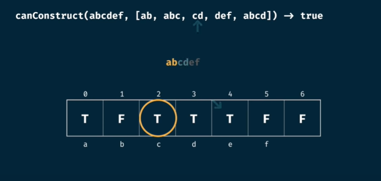

### DYNAMIC PROGRAMMING
- `Note` :anchor: are Problems

#### :crossed_swords:[Start w/ Alvin's Video](https://www.youtube.com/watch?v=oBt53YbR9Kk&ab_channel=freeCodeCamp.org)

##### DP Basics (DP = Recursion + Memorization )
- Purpose
  - Helps to reduce Exponential(Example 2^n) complexity to polynomial(Example n^2 or n^3) complexity.
- How to identity problem
  - While thinking of problem we will have one or more choices. Choices lead to `recursion`, where each choice is a branch of recursion tree
  - Solve a little bigger recursion tree. If tree nodes are repeated, you can use `memorization`
  - When we have choices and question talks about max/min optimization problems, It may be DP. :pill: Of-Course there is not short-cut to nothing.
- DP Types
  - Memorization/Top-Down (Recursion + Memo object)
    - Top-Down means -> Think of recursion tree. We start with Root node(Bigger input) and come down to leaf.
  - Tabulation/Bottom-Up (Iteration + Memo object)
    - Top-Down means -> We start solving leaf node(smaller inputs) and move towards the biggest input
- Steps for Solving any DP
  - Start with Memorization approach
    - Figure out which input can be divided to sub-problems. Draw Recursion Tree with tha input as parameter
    - Add base conditions in tree
    - `Optimize` by identifying repetition of nodes, and using memo object to avoid repetitive calculation
    - Implement code
    - [How to code memorization](https://youtu.be/oBt53YbR9Kk?t=1565)
  - Then you can move to Tabulation approach
    - Figure out which input is smallest sub-problems. Draw Table or Memo object starting with that input. 
    - :bulb: Sometimes table size = input-size + 1, because of 0-Indexing come into picture. Example Grid Traveller
    - Initialize table with default values, then initialize the smallest problem values into table 
    - `Optimize` space complexity of table by reducing table size to remove unnecessary space   
    - Implement code
- [Recursion Time/Space Complexity basics](https://www.youtube.com/watch?v=oBt53YbR9Kk&t=648s)
    - `Time Complexity = O(branchFactor ^ heightOfTree)`
    - `Space Complexity = O(heightOfTree)`
    - 
 
        
Example1

        
      

    - 
 
        
Example2

        
      

    - 
 
        
Example3 Brute-force Recursion Fibonacci, which forms Asymmetric recursion Tree

        O(dib) <= O(fib) <= O(lib) ==> Time O(fib) = O(2^n) , Space O(fib) = O(highestHeightOfTreeBranch) = O(n)
      

    - 
 
        
Example4 Memorized Recursion Fibonacci

        
      

    - :bulb: For any DP problem, try to find Time & space complexity from tabulation approach, as it is easy to visualize with memo table  
      Time complexity = #Table-Cells * #Each-Cell-Time-Complexity  
      Space complexity = #Table-Cells * #Each-Cell-Storage

##### Problems using both Memorization & Tabulation
- :anchor: Fibonacci
- :anchor: Grid Traveller Problem : gridTraveller(m, n)  2D m*n given. You may move right and down. In how-many ways you can move from top-left to bottom-right cell ? 
  - Hint : gridTraveller(a, b) = gridTraveller(b, a). So space= O(m*n/2)
- :anchor: canSum(targetSum, nums[]) Return true is targetSum can be generated using numbers of Array. canSum(7, {5, 3, 4, 7})  
  1. All numbers non-(-ve)
  2. You may use an element from array multiple times
     - Question Resemblance : 2Sum, 3Sum problems of Array
     - Hint : A number can be used multiple times, so Recursion tree parameter is only totalSum
     - In Tabulation, at any index think ahead of future indices or at any index look back of existing indices
- :anchor: howSum(targetSum, nums[]) Return any combination whose sum generates totalSum. canSum(7, {5, 3, 4, 7})  
  1. All numbers non-(-ve)
  2. You may use an element from array multiple times
- :anchor: bestSum(targetSum, nums[]) Return any combination whose sum generates totalSum. bestSum(7, {5, 3, 4, 7})  
    1. All numbers non-(-ve)
    2. You may use an element from array multiple times
- :anchor: canConstruct("abcdef", {"ab", "abc", "cd", "def", "abcd"}) 
    1. You may use a word from array multiple times
  - :alien: How do we approach tabulation . Hint: Form an array of size = targetStringSize + 1, Each position in array means if string upto current position(not included) can be formed
    - 
 
        
canConstruct() Tabulation Approach

         
        Index 3 means if "ab" can be constructed. How to check : If any of string in array ends with "b" AND targetString starts with "ab". Can be easily achieved via indexing.
      

- :anchor: countConstruct("abcdef", {"ab", "abc", "cd", "def", "abcd"}) 
    1. You may use a word from array multiple times
- :anchor: allConstruct("abcdef", {"ab", "abc", "cd", "def", "abcd"}) 
    1. You may use a word from array multiple times

#### :crossed_swords:[Continue w/ Aditya Verma's Series](https://www.youtube.com/watch?v=nqowUJzG-iM&list=PL_z_8CaSLPWekqhdCPmFohncHwz8TY2Go&ab_channel=AdityaVerma)
