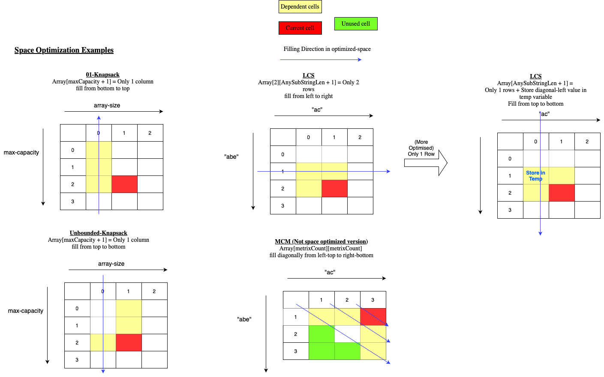

### DYNAMIC PROGRAMMING

#### :crossed_swords:[Start w/ Alvin's Video](https://www.youtube.com/watch?v=oBt53YbR9Kk&ab_channel=freeCodeCamp.org)

##### DP Basics (DP = Recursion + Memorization )

###### Purpose
- Helps to reduce Exponential(Example 2^n) complexity to polynomial(Example n^2 or n^3) complexity.

###### How to identity problem
- While thinking of problem we will have one or more choices. Choices lead to `recursion`, where each choice is a branch of recursion tree
- Solve a little bigger recursion tree. If tree nodes are repeated, you can use `memorization`
- When we have choices and question talks about max/min optimization problems, It may be DP. :pill: Of-Course there is no short-cut for nothing.

###### DP Types
- Memorization/Top-Down (Recursion + Memo object)
  - Top-Down means -> Think of recursion tree. We start with Root node(The Biggest input) and come down to leaf.
- Tabulation/Bottom-Up (Iteration + Memo object)
  - Top-Down means -> We start solving leaf node(smaller inputs) and move towards the biggest input

###### Steps for Solving any DP
- Always Start with Recursive Memorization approach
  - Figure out which input can be divided to sub-problems. Draw Recursion Tree with tha input as parameter
  - Add base conditions in tree
  - `DP Optimization` by identifying repetition of nodes, and using memo object to avoid repetitive calculation
  - `Important` Initialize table with default values
  - Implement code
  - [How to code memorization in Recursion](https://youtu.be/oBt53YbR9Kk?t=1565)
    - Return if cached at beginning of recursion
    - Wherever return statement is there, push to memo and then return
- Then you can move to Iterative Tabulation approach
  - Figure out which input is smallest sub-problems. Draw Table or Memo object starting with that input. `BackTrack` using recursion knowledge. 
  - :bulb: Sometimes table size = input-size + 1, because most recursions end at element = 0 . Example, Grid Traveller.
  - `Important` Initialize table with default values, then initialize the smallest problem values into table 
  - `Space Optimization` space complexity of table by reducing table size to remove unnecessary space. Here time complexity remains same.
  - Implement code
  - :bulb: In Tabulation, at any index think ahead of future indices(look-ahead) or at any index look back of existing indices

###### Recursion Gyan
- 1st type: Think parent node as a function of result returned by child node. Assume child node returns something. `When at current recursion node of tree, think what the child would return to me and what I would need to return to my parent`
- 2nd type: While going from root to leaf, calculate result cumulatively. At-last at leaves, result will be fully formed.
`Note` Either the function returns void and just propagates result bottom-up the tree. Type-2 usually leads to Tail Recursion 
- 3rd type : Piggy-backing + 1st recursion type. The actual answer is not return value. Example, answer is max or all returned values of all Tree nodes. 
  Actual answer can be global-object-variable or a mutable object passed to recursion tree. If this piggyback answer is String(immutable) or primitive, Use a wrapper class with that string/primitive variable. [Example](https://www.geeksforgeeks.org/diameter-of-a-binary-tree-in-on-a-new-method/) 
  :bulb: Piggybacking implementation is exactly same as memo object, `Add update "the actual result" wherever the recursion stack returns. Result most of the time depends on the returned value of child node.`[Example](./Practice/src/main/java/com/p2/dp/aditya/LongestIncreasingSubsequence.java)

###### [Recursion Time/Space Complexity basics](https://www.youtube.com/watch?v=oBt53YbR9Kk&t=648s)
- `Time Complexity = O(branchFactor ^ heightOfTree)`
- `Space Complexity = O(heightOfTree), i.e. Always Remember to count recursion-stack size as auxiliary space`
- 
 
    
Example1

    
  

- 
 
    
Example2

    
  

- 
 
    
Example3, Brute-force Recursion Fibonacci, which forms Asymmetric recursion Tree

    O(dib) <= O(fib) <= O(lib) ==> Time O(fib) = O(2^n) , Space O(fib) = O(highestHeightOfTreeBranch) = O(n)
  

- 
 
    
Example4, Memorized Recursion Fibonacci

    Time = O(n), Space = O(n) if Recursion/Top-Down, O(1) if Bottom-Up
    
  

- :bulb: For any DP problem, try to find Time & space complexity from tabulation approach, as it is easy to visualize with memo table  
  Time complexity = #Table-Cells * #Each-Cell-Time-Complexity  
  Space complexity = #Table-Cells * #Each-Cell-Storage

###### DP on Trees
- DP mostly uses 1st type, as function always returns a value => returned value helps in parent's result. `Exception to this is LCSS problem`.
- DP choices in Tree -> Left or Right node

###### Graph Recursion & DP Recursion in-case of GRID
- Graph doesn't have any specific terminal condition, once all nodes process (which is tracked using Visited DS), recursion stops. Recursion method's parameter takes neighbors indexes from parent's indexes. dfs(0,0) --leads To-> dfs(0,1), dfs(1,0), dfs(-1,0), dfs(0,-1)
  - DP has terminal condition. Recursion method's parameter keeps reducing. For example , Grid Traveller starts with (3*3 matrix) then reduces to (2*3) or (3*2) so on. gridTraveller(3,3) --leads To-> gridTraveller(2,3) & gridTraveller(3,3)

###### Tricks & Tips on How to approach DP
- Final goal is to give the space-optimized version of solution. 
  - Start with recursion. Write recursion-method signature + Base condition + equations based on different choices(example whether to include or exclude number in 01-knapsack)
  - Switch quickly to using memo, tabulation, space-optimization
- `Input & Base Condition Trick`
  - DP problems GRID or array, we generally use 1-indexing . If n-array input, root node of recursion will be dp(n) . Note, we are going from right to left
  - Base condition Trick Vs Graph Recursion
    - In graph, we use complete self-servicing recursion. If -ve index comes ,handle than in next recursion call. 
    - In DP memo[] objects using [0..n], so suppress -ve indexes in parent call itself rather handling in child call. Base if we have recursions for n=0 till n=n, and memo table is also of size (n+1), it doesn't contains -ve numbers
- Space optimized version implementation
  - The Time complexity doesn't change => the for loops doesn't change. If O(m*n) optimized/reduced to O(m), 2 for-loops would still exist imagining virtual columns. Data read/write would happen from O(m)
  - Code space-optimized for-loops by seeing diagram of table.
                                         
##### Problems using both `Memorization & Tabulation`

###### :rocket: Fibonacci

###### :rocket: Grid Traveller Problem : gridTraveller(m, n)  2D m*n given. You may move right and down. In how-many ways you can move from top-left to bottom-right cell ? 
- Hint : gridTraveller(a, b) = gridTraveller(b, a)
- :bulb: Space can be O(n) . Draw and think(Each cell depends on Upper & left Cells only)

###### :rocket: canSum(targetSum, nums[]) Return true is targetSum can be generated using numbers of Array. canSum(7, {5, 3, 4, 7}). All numbers non-(-ve). You may use an element from array multiple times. 

- If (-)ve number is there, targetSum might increase in recursion and go into infinite recursion as unbounded problem
- Question Resemblance : 2Sum, 3Sum problems of Array
- In Tabulation, at any index think ahead of future indices(look-ahead) or at any index look back of existing indices
- Two Approaches as elements can be used multiple times. Checkout read Unbounded Knapsack note for sure.
- :bulb: These are subset(non-continuous) problems instead of sub-array(continous). But we are traversing in an order, i.e. an element discard once is not visited again .

###### :rocket: howSum(targetSum, nums[]) Return any combination whose sum generates totalSum. canSum(7, {5, 3, 4, 7}) . All numbers non-(-ve). You may use an element from array multiple times.

###### :rocket: bestSum(targetSum, nums[]) Return any smallest combination whose sum generates totalSum. bestSum(7, {5, 3, 4, 7}). . All numbers non-(-ve). You may use an element from array multiple times.
- Initialize the table[targetSum+1][nums.len+1] with null . table[x][0] with Empty list 
- Hint : Each recursion node will contain a smallest combination after choosing from child nodes' lists

###### :rocket: canConstruct("abcdef", {"ab", "abc", "cd", "def", "abcd"}). You may use a word from array multiple times

- :alien: How do we create memo object .
  - For recursion + memorization, You can use Map<subString, Boolean> 
  - For tabulation 
    - Hint: Form an array of size = targetStringSize + 1, Each position in array means if string upto current position(not included) can be formed
    - 
 
        
memo[] in Tabulation Approach

         
        Index 2 means if "ab" can be constructed.  
        Use look-ahead approach here. At index=2 which is T, check which all words can be formed starting with "ab" by iterating over input list. Here, You can only form "abcd" 
      

    
###### :rocket: countConstruct("abcdef", {"ab", "abc", "cd", "def", "abcd"}). You may use a word from array multiple times

###### :rocket: allConstruct("abcdef", {"ab", "abc", "cd", "def", "abcd"}).You may use a word from array multiple times

#### :crossed_swords:[Continue w/ Aditya Verma's Series](https://www.youtube.com/watch?v=nqowUJzG-iM&list=PL_z_8CaSLPWekqhdCPmFohncHwz8TY2Go&ab_channel=AdityaVerma)

##### :rocket: 01-Knapsack. An item can be filled in knapsack 0 or 1 times, So not repeated times. Return max profit.
`NOTE` 💡 Below all problems are using Non-(-)ve numbers
##### :rocket: Can SubSet Problem or canSum, if a subset(not continuous) of given array can generate targetSum
##### :rocket: Is Equal-Sum-2-Partitions-Possible Problem. if 2 subset of given array can generate same sum => if a subset of given array can generate arraySum/2. 
- Note: Here, partition is not substring partition unlike MCM Partition problems

##### :rocket: countSum. How many subsets of given array can generate targetSum ?
##### :rocket: minDifferenceOfTwoPartitions. Return the minimum difference of any 2 partitions of an array
##### :rocket: countWaysOfTwoPartitionsWithGivenDifference(nums[], difference). Return the count of possible ways where S1 - S2 = diff
##### :rocket: countWaysOfAssignPlusMinusToAchieveTargetSum(nums[], targetSum) . Return the count of possible ways where you can prefix + or - before array numbers and generate targetSum by adding-up 
- :bulb: Transform to countWaysOfTwoPartitionsWithGivenDifference Problem

##### :rocket: Unbounded Knapsack. Return max profit.
- :bulb: How to build Recursion Tree, Two things come to mind
  - recursion(maxCapacity) . Using only maxCapacity as parameter and subtracting each element in array is the choice
    - Not preferred, as doesn't work always. For example, If question asks about count number of was to achieve targetSum, it might count both {1, 2, 3} and {2, 1, 3} as ordering is not considered
    - :clown_face: [Few questions asks for such duplicate combinations, Example CombinationSumIV377](./Leetcode/src/main/java/year2k21/common/pattern/dp/date21022023/CombinationSumIV377.java), so use this approach 
    - Also branching factor is high. #Branches = #ArraySize
    - 💡 `BIG NOTE` With this approach also DP or Memorization possible & it will be 1D memo(instead of below approaches 2D Memo). Example: [Word Break](https://leetcode.com/problems/word-break/submissions/1368149615/)
  - recursion(maxCapacity, arrayIndex) . Using both maxCapacity, currentArrayIndex as parameter and whether to consider the element at arrayIndex is the choice
    - `Preferred` No redundancy in output
    - Branching factor = 2
    - 01-knapsack Illustration
    <pre>                                      
                              recursion(maxCapacity, arrayIndex)
                                             /     \
                                    Include /       \Exclude
                                           /          \
      recursion(maxCapacity-weight, arrayIndex-1)     recursion(maxCapacity, arrayIndex-1)
    </pre>
    - Unbounded-knapsack Illustration
    <pre>                                      
                            recursion(maxCapacity, arrayIndex)
                                             /     \
                                    Include /       \Exclude
                                           /          \
      recursion(maxCapacity-weight, arrayIndex)     recursion(maxCapacity, arrayIndex-1)
    </pre>

##### :rocket: Rod cutting problem. A rod of length W to be cut into multiple pieces. Price of 2cm rod differs from 1cm rod price , Price[1, 2, 4] and length[1, 2, 3] is given. Means Price for 1cm, 2cm, 3cm rods are 1rs, 2rs, 4rs resp. Return max profit
- :bulb: Sometimes Problem doesn't have length[] as it is just [1..rodLength]
##### :rocket: Coin change problem, Count# Ways where coin can be added up to targetSum. A given coin(example 1rs) can be used multiple times. Sounds similar to countSum, only difference is 01 vs unbounded
##### :rocket: Coin change problem, Min# of coins which can be added up to targetSum. A given coin(example 1rs) can be used multiple times. Sounds similar to countSum, only difference is 01 vs unbounded
- recursion() return-value or table-cell value is min at that position
- Initialize table to Integer.MAX
##### :rocket: LCS (Longest Common Subsequence) .Find LCS length or print LCS ?
- `SubSequence vs Substring` SubSequence need not be made of consecutive chars.
##### :rocket: LCSS (Longest Common Substring) .Find LCSS length or print LCSS ?
- :bulb: Start with LCS Tabulation & proceed. If X[i], Y[j] non-matching, mark memo as "", as it won't contribute to next iterations
  Else ,Check if X[i-1], Y[j-1] matched & Check memo[i-1][j-1] + currentChar
- 
<pre>
  Each cell contains longest common suffix "must-including" those indices . If doesn't include, then store ""
  X = "abed"
  Y = "gababe"
  
  memo[2][3] = "ab"
  memo[3][3] = ""
</pre>
##### :rocket: Shortest Common Super-sequence. Given "geak" & "eke", output is "geake". Both "geak" & "eke" should be subsequence of output
- Print SCS
- Return Length = (str1Len + str2Len) - (LCS.length)
- :bulb::wink: Similar Problem Names : Graph's Longest common supersequence, Graphs' Longest Consecutive-Sequence  
##### :rocket: Min# Insertion & Deletion to convert str1 to str2. Example "heap" to "pea". Delete "h" & "p"(Notice "heap") and Insert "p"(Notice "pea")
- :bulb: Deletion# = str1Len - LCS.length, Insertion# = str2Len - LCS.length
##### :rocket: LPS (Longest palindrome subsequence). Example Input :"agbcba", Output :"abcba"
- :bulb: LCS(str, reverseStr)
- `Reverse String` new StringBuilder().append(s).reverse().toString(); 
##### :rocket: LPSS (Longest palindrome substring). Example Input :"babad", Output :"aba" or "bab"
- :bulb: 👻 `BIG NO, LCSS(str, reverseStr) DOES NOT WRONG, Check NewConcepts.md `
##### :rocket: Min# Deletion to make a string a palindrome. Example Input : :"agbcba". Output= 1 (remove "g")
- :bulb:  Deletion# = strLen - LCS.len(str, reverseStr)
##### :rocket: Min# Insertion to make a string a palindrome. Example Input : :"agbcba". . Output= 1 (Add "g")
- :bulb:  Insertion# = strLen - LCS.len(str, reverseStr)
##### :rocket: LRS( Longest Repeating subsequence). Example Input :"AABEBCDD", Output :"ABD"
- :bulb: LCS(str, sameStr) and matching char condition => str[i] == str[j] & i != j, So same position matching is not considered matching.
##### :rocket: Is subsequence . Given 2 strings if X is subsequence of Y
- :bulb: LCS(str1, str2) = smallestOf(str1, str2)
##### :rocket: MCM (Matrix chain multiplication)/Partitioning type of DP problems
- :bulb: New Type of DP question
  - recursion(i,j) will have multiple partitions. Recursively solve considering each partition and find best result. i <= Partition/k < j
  - Go left to right as we are partitioning
  - `VVIMP Intution` We will end up dividing array into many partitions at the end, at each step we divide one part to 2 parts. The smaller parts to again 2 smaller-er parts, so on 
  - Slight Variation: Divide array in "k" Segments w/ some Condition. Recursion tree node wont have both start and end indices, rather only one index.
- Question: Given arr[] = {40, 20, 30, 10, 30}, Return min cost for multiplying the matrices represented by arr[] `or` Put parenthesis around matrices for minimum cost. Here, 4 Matrices = {40*20, 20*30, 30*10, 10*30}. 
  - :bulb: Hint
    - Cost of Multiplication of 2 Matrices(X=a*b, Y=b*c) =>  #Number Of Multiplications Internally = a*b*c
    - A * B * C * D can be multiplied 3 types by using partitioning in between => (A) (BCD) or (AB)(CD) or (ABC) (D) 
    - 2 memo[][] objects. One for cost, another for parenthesis. `Nice to notice how parenthesis memo is built`. Primarily recursion method returns cost, but parenthesis-building sneaks in and builds memo for parenthesis also
- Space Complexity = 2 * O(n^2), Time Complexity = O(n^3). n^2 cell and for each cell k=n is used .
##### :rocket: Palindrome Partitioning. Given a string "rixin" how many min# Partitioning can be done so that each partition is a palindrome. Output : 2 r|ixi|n . For input "nixin" ,Output is 0
- For Maximum partitioning, @each character put a partition. So "rixin" has max 4 Partitioning.
- :bulb: i <= Partition(k) <= j. Note inclusive of "j", as we need to consider the if whole string is palindrome
- 2 memo[][] can be used. One for count(int), other for isPalindrome(boolean). Usage, isPalindrome(XstrY) is palindrome if X=Y and isPalindrome(str)= True. `Nice to notice how palindrome memo is built`. It is actually independent of count calculation and built at the beginning. Actually, recursion node returns cost & uses palindromeemo[][]
- [Check generatePalindrome() Solution From GFG](https://www.geeksforgeeks.org/palindrome-partitioning-dp-17/)
  - Start with String of 1 char and mark them as palindrome, P[i][j] means String starting w/ i-th index & ending w/ j-th index.  
  Then go increment order of string of len 2 till n, Find possible string & mark as palindrom if i==j & p[i+1[j-1] is palindrome  
  Note, it is important to go from str lengnth lower(1) to higher(n)
##### :rocket: Boolean parenthesis. Given String "T ^ F & T" ,which has char ∈ {T, F, &, |, ^), How many ways If you put parenthesis, it can evaluate to True.
- memo Pair[][]. Pair<#Ways-True, #Ways-False>

:rocket: :bulb: 🍾 New Type of DP question, Paritioning w/ 2 levels , i.e. 2D or 2-dimenson or Two Dimension DP
##### :rocket: isScrambledString(str1, str2). ScrambledString Definition : Form a tree like below(root as actual-string to leaf as single-character) with a string with two conditions 1.Leaf nodes can't be empty string 2.For any non-leaf nodes, child's can be swapped 0 or 1 times 3. Then go left->right direction in tree for the "leaf" nodes. Voilà new string is formed. Input string and this new string are Scrambled Strings
- `MustRead` Again 2 level DP choices. `Note` In 2 level DP, there is 2 level choices, Check how in both levels, a choice is selected over other choices. Here 1st level choice is multiple partitions, 2nd level is whether swapping is there are not. 2nd level "AND" is used, 1st level "OR" is used

<pre>
                  great
                 /    \
                /      \                     -->   Forms etagr, So isScrambledString(great, etagr) = True
              eat       gr(gr, eat swapped)
             / \       /  \
            e   at    g   r
               / \
              t   a(a, t swapped)
</pre>
- :bulb: memo is Map<str1#str2, bool>  
<pre>
   DP Choice: (2 levels)
   1st level at partitioning(k=1 or 2 or 3...)
   2nd level at each partition(k=1),  "great" can be "g + reat" or "reat + g"
  
                       isScr(great, etagr) //Only k=1 is depicted here
               k=1/                     \k=2    \k=3   \ k=4                  (k From 1 till strLen) 
                /                        \       \      \
          isScr(g,e)&&isScr(reat,tagr)
          ||
          isScr(g,r)&&isScr(reat,etag)//Considering Swapped case
  
  2nd level Better Intuition:(for k=1 ie partition at 1st char)
               g   reat                            g   reat  //Swapping case
               |    |              or                \ /
               |    |                               / \
               e   tagr                          etag   r
</pre>
##### :rocket: Egg Dropping Min Attempt Problem . Egg breaks after a certain floor. Given #Egss & #Floors, How-many minimum# egg-drops to find the threshold floor(Considering any floor can be threshold floor, No particular threshold floor given). Threshold floor is the floor from bottom-up, beyond which the egg will break.
- `Note` Worst Case = o(#Floor): With 1 egg you can start from bottom to up and find the threshold floor with max attempts
- `MustRead` Again 2 level DP choices. `Note` In 2 level DP, there is 2 level choices, Check how in both levels, a choice is selected over other choices. Here 1st level choice is multiple partitions, 2nd level is whether egg breaks or not. 2nd level "MAX" is used, 1st level "min" is used
<pre>
/**
 * If you get DP Choice + Base Conditions, you can solve this
 *
 * DP Choice 2 level
 *      1st level partition from floor [1 to floorMax]              (including top floor)
 *      2nd level at each partition or floor, if egg drops
 *                          solve(eggCount, floorCount=k) and @Partition kth floor
 *                          /          \
 *                         /(Egg brks)  \(Egg Not brks)
 *                        /(Go Down)     \(Go Up)
 *                       /                \
 *        solve(eggCount-1,k-1)   solve(eggCount,TotalFloor-k)//Remember this (TotalFloor-k) not (floorCount+1), as we want #floors here
 *
 *
 *   Base Condition
 *          If egg =0, attempt=0. If egg=1, attempt=f(with 1 egg you will go simply bottom-up)
 *          If floor =0, attempt=0. If floor=1(i.e. number of floors 1), attempt=1
 *
 *   memo [eggCount+1][floorCount+1] // Incl ZERO indices
 */
</pre>
##### :rocket: Diameter of Binary Tree . Return max path between any 2 leaves of binary tree. Max path need not go via root.
##### :rocket: Max Path sum of weighted nodes Any node to Any node . -Ve nodes exist
##### :rocket: Max Path sum of weighted nodes Any leaf to Any leaf. -Ve nodes exist
##### :rocket: LIS , Longest Increasing Subsequence, Return array[] or Return size Longest Increasing Subsequence of Given Array. -ve num possible.
<pre>
**
 * Question is Increase sequence, so i am going left to right, unlike other problems
 * Using Zero indexing in below solution
 * 
 * Below is VVIMP: (PreviousPickedValueIndex is required state for recursion node)
 * - If the current element is greater than the previous element, then we can either pick it or don't pick it 
because we may get a smaller element somewhere ahead which is greater than previous and picking that would be optimal.
So we try both options. So 2 choice branches
 * - If the current element is smaller or equal to previous element, it can't be picked. So 1 choice branch
 *
 * Input : [0,10,3,4], Ans = 3[i.e. 0, 3, 4]
 *                                      (0,MIN)         --1st arg Index, 2nd arg  PreviousPickedValueIndex need instead
 *                              pick 0 /           \No-pick 0
 *                              (1,0)               (1,MIN)
*                         pick 10/     \No-pick 10
 *                           (2,10)      (2,0)
 *                     No -pick 3/     pick 3/  \ No-pick 3
 *                          (3,10)       (3,3)
 *                   No-pick 4/      pick 4/  \No-pick 4
*                  (4,10)--ret 0   (4,4)--ret 0  (4,3)--ret 0
 *
 * memo Map or 2D array(little complicated) can be used, space can be optimized to O(n) from O(n*2)
 * Time = O(n^2), space = O(n^2) or O(n)
 */
</pre>
##### :rocket: Kadane’s Algorithm. The Largest-Sum Contiguous Sub-array. Includes -ve numbers. Input:{-2, -3, 4, -1, -2, 1, 5, -3}. Output:7 for continuous subArray {4, -1, -2, 1, 5}
- Type 3 recursion, Piggy-backing getMaxSumStartingAtIndex(). Same as Max-Path-Sum Tree Problem
- If we traverse left to right, `getMaxSumStartingAtIndex(idx) = Max (arr[idx], arr[idx] + getMaxSumStartingAtIndex(idx+1)), output= Math.max(output, getMaxSumStartingAtIndex(idx))`
- Time = O(n), space = O(1) just depends on child's value

#### :crossed_swords: CHEAT-SHEET/Tips
- SubSequence, SubString problems can be DP(or can be sliding window or Graph(LongestConsecutiveSubSequence))
- `Arrays.fill(memo, -1)` for initializing the memo object
- Reverse String ==> `new StringBuilder(s).reverse().toString()`
- :bulb: DP can solve questions involving non-consecutive elements of array or String
- For few questions, start directly with tabulation Approach, But remember what each cell contains
  - LCSS
  - Maximum Square  
- You can debate travering left->right or right->left based on problem types
  - Usually I have solved simple question(which are covered in the beginning right->left).
  - Then questions like MCM, LIS, Kadane's are using left->right traversal. Also BuyAndSellStockIIIMax2Txn123 uses left->right which eases solution compared to right->left

#### :crossed_swords: SPACE OPTIMIZATION
- Sometimes memo[i][j] = memo[j][i]  
- Checkout 0-1 knapsack intelligent space optimisation. i.e. Traverse from right to left of 2d matrix

#### Good Questions
- Jump Game Variants (Use Greedy instead of DP. Time=O(n), Space=O(1))
  - `Jump Game 65` > You are given an integer array nums. You are initially positioned at the array's first index, and each element in the array represents your maximum jump length at that position. Can you reach the End ?
    - Intuition: Maintain "maxReachable" variable. If maxReachable >= len-1, Return true. Space = O(1) like Kadane
  - `Jump Game || 45` > Return #Jumps
    - Along with  "maxReachable", maintain another variable called "currentStepEnd". Whenever "currentStepEnd" reached, ++jumpCount
- Derived Problems of `CanSum` 
- Derived Problems of LCS 
- LCSS
- LPSS
- LIS (There is n(logn) Greedy solution https://leetcode.com/problems/longest-increasing-subsequence/solutions/1326308/c-python-dp-binary-search-bit-segment-tree-solutions-picture-explain-o-nlogn/?envType=study-plan-v2&envId=top-interview-150)
- Egg-Floor Problem
- Kadane Variants
  - Max Product Sub Array : 2 variables ,compared to 1 var of MaxSumArray. 1st to store max till last Index, 2nd to store Min(To handle -v *-ve ) scenario
  - Maximum Sum Circular Subarray([Leetcode 918](https://leetcode.com/problems/maximum-sum-circular-subarray/description/?envType=study-plan-v2&envId=top-interview-150)
- Max Square : Matrix of 0s and 1s. What is the size of max square of 1s. Start w/ tabulation. Each cell contains result for cell ending at (i,j). Each cell depends on left ,top and left-top diagonal. Result[i,j] = min(Result[i-1,j], Result[i,j-1], Result[i-1,j-1]) + 1
- Divide an array into k segments with segments satisfying some condition

#### Similar Problem Name Twister
- DP: Longest Increasing Subsequence, Longest Common Subsequence, Longest Common Substring, Longest Repeating Subsequence, Longest Palindrome Subsequence, Shortest Common SuperSequence
- Graph: Shortest Common SuperSequence
- Greedy: Longest Consecutive Subsequence

#### Digit DP
- [Check Concept & Questions](https://github.com/pintub/dataStructure-algo/tree/master/Practice/src/main/java/com/p2/dp/aditya)
