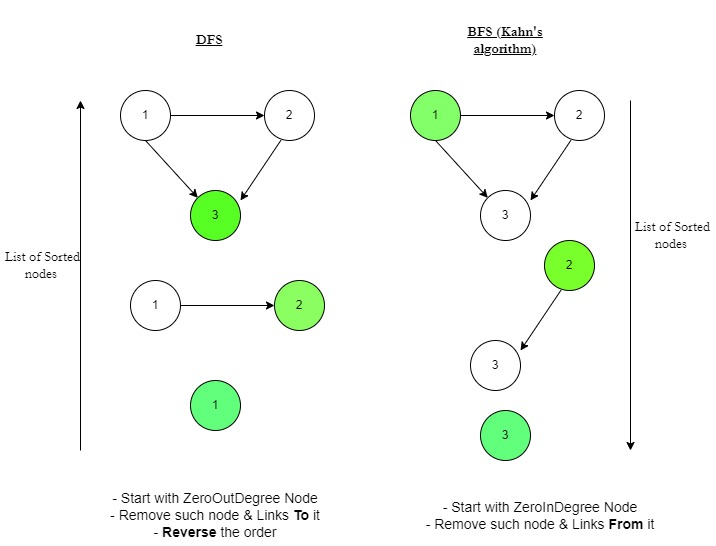
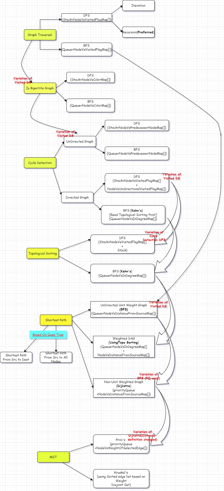

### GRAPH
- Each problem has variant depending on graph type and have different solution(i.e. BFS/DFS)

#### :crossed_swords:[Start w/ Alvin's Video](https://www.youtube.com/watch?v=tWVWeAqZ0WU&ab_channel=freeCodeCamp.org)

##### Graph Basics
- Types
  - Directed Graph vs UnDirected Graph
  - Cyclic vs Acyclic Graph
    - `Note`UnDirected Graph single edge can form a cycle. We consider mitigating going in loop for these graphs, but these cycle are not considered as real cycles in problem definition(e.g. Cycle detection problem)
  - Weighted vs UnWeighted Graph
    - Edge has weight
- Nodes/Vertices(V) & Edges(E)
- InDegree(node),OutDegree(node) for Directed Graph vs Degree(node) UnDirected Graph
  - For an UnDirected graph, TotalDegree(AllNodes) = 2 * #Edges
- Path in a Graph(No repetition of vertex considered)
- Graph Representation
  - Visual
    - Node and Edges
  - Implementation
    - `Adjacency list` (Map of vertex vs List of neighbor nodes `or` Array List or Array List)
    - `List of Edges`. This should be converted to Adjacency list before solving problems. For Undirected edge a-b, consider adding "b" as neighbor for "a" and "a" as neighbor for "b"
    - `Modified Adjacency list` for weighted Graph (['a' -> ['b', 1], 'b' -> ['c', 1]]), Both neighbor and weight information is stored
- :bulb: [Graph can have disconnected components](resources/graph/GraphDisconnectedComponents.PNG)

##### :rocket: Traversal Problem
- Types 
  - DFS (Using stack) - Iteration(with explicit stack) or Recursion(with natural call-stack). :point_right: [Refer for Intuition](./resources/graph/CycleDetectionDFS.png)
  - BFS (Using Q, like Tree level order Traversal) - Iteration(with explicit Q) . `Note` It may(or may not) be solved w/ recursion, but overhead. :point_right: It's like expanding towards all directions starting from a node
- Related Notes
  - Time  = `O(V+E)` :bulb: This is not intuitive for me, Remember this. Some posts say it is O(V)
  - Auxiliary Space = `O(V)` for Stack or Q + `O(V)` for visited Node DS
  - :bulb: Points to consider during Traversal
    - Avoid Cycles (Both actual cycle in Directed graph and dummy cycles in UnDirected graph) Maintain Visited DS, i.e. Array Map(NodeVsVisitedFlag) or Set(Of visited nodes). I suggest to use ArrayMap because of many reason and problem variants
    - Avoid Duplicated node visit (Same Visited DS will help)
    - Consider Disconnected Components (Maintain an outer-loop for DFS/BFS to go through whole nodeList. This outer-loop actually processes only when disconnected components encountered, as For other nodes would be marked as visited)

#### :crossed_swords:[Continue w/ Striver's Video Series](https://www.youtube.com/watch?v=LCrovIMurxY&list=PLgUwDviBIf0rGEWe64KWas0Nryn7SCRWw&ab_channel=takeUforward)

##### :rocket: Bipartite Graph For UnDirected Graph(If a Graph can be colored using 2 colors so that no 2 adjacent nodes have same color)
- Theoretically, if a cycle with odd number of nodes exist, then non-Bipartite. So solution doesn't follow this theory
- Types
  - BFS
  - DFS
  - Related Notes
    - :bulb: Instead of nodeVsVisitedMap, use a nodeVsColorMap. If a visited node' color = predecessor node's color, non-Bipartite

##### :rocket: Cycle Detection Problem (`Note` Not single edge cycles, Rather real cycles)
- Types
  - For UnDirected Graph
    - DFS
    - BFS
    - Related Notes
      - :bulb: If a node visited by 2 different predecessor nodes, then cycle is found. BTW this solution doesn't work for Directed Graph, where 2 arrow converges to a node. 
      So for UnDirected graph, Enhance Visited Map as NodeVsParent-node-from-which-The-Node-got-visited. If the same node is visited from another parent node, then cycle exists. Source node can have parent as NULL. No need to maintain another NodeVsVisitedFlag map.
      - Time  = `O(V+E)`
      - Auxiliary Space = `O(V)` for Stack or Q + `O(V)` for visited Node DS
  - For Directed Graph
    - DFS
      - Related Notes
        - :bulb: Why UnDirected Graph Algo doesn't work, Already explained above. [Run through Example](./resources/graph/WhyCycleDetectionAlgoForDirectedGraphDifferent.PNG)
        - Along with Visited DS(NodeVsVisitedFlag Map), use a DS to keep track of visited nodes in a single direction(Let's call it Unidirectional DS, This is also NodeVsVisitedFlag with roll-back). [Refer diagram](./resources/graph/CycleDetectionDFS.png). 
          If u->v exists, "u" is marked as visited in new DS, then "v" marked as visited in new DS. 
          Roll-back the node from this new DS if you hit dead-end while searching for cycles and going back in reverse direction. 
          If same node found visited in this DS, then cycle found.
        - Time  = `O(V+E)`
        - Auxiliary Space = `O(V)` for Stack + `O(V)` for visited Node DS + `O(V)` for Unidirectional Node DS
    - BFS (`Note` Cycle Detection by Kahn's Algorithm, Read below Topological sorting using BFS before proceeding w/ this)
      - Related Notes
        - :bulb: If |Count the topologically sorted elements| != |V| , Then cycle exists

##### :rocket: Topological sorting
- Definition
  - Only meant for `DAG(Directed Acyclic Graph)`
  - If an edge u->v present, then in sorted order "u" appears before "v"
- Use-Case
  - Maven Dependency
- Intuition
  - 
- Types
  - DFS
    - Related Notes
      - `Intuition` Put Nodes with Zero Out Degree 1st in stack and revert stack for ordered list
      - :bulb: Almost same logic as Cycle Detection DFS Algo which uses a Unidirectional DS(along with visitedNode DS) for keeping track of nodes in a particular direction in reverse order on node-visit. Instead of Unidirectional-DS-Map here we use a Stack.  
        If u->v exists, "u" is kept on top of "v". Thus stack gives topological sorted ordering from top to bottom. Try with same example diagram. 
        Another difference compared to cycle detection, `we don't roll back elements from stack`.
      - We insert the nodes with `Zero outDegree` first into stack & actual ordering in top to bottom of stack
      - So Total DS = O(V) for Call-Stack + O(V) for visitedNode DS + O(V) for Stack = `O(3*V)`
      - Time  = `O(V+E)`
  - BFS (Kahn's Algorithm)
    - Related Notes
      - `Intuition` Maintain an NodeVsInDegree ArrayMap. We insert the nodes with `Zero inDegree` to queue . 
      Decrease InDegree ArrayMap once parent processed .
      - Uses only Q & InDegree ArrayMap. Note, visitedMap not used
      - :bulb: a>Find zero Degree node Q, when degreeOfNode becomes zero b>when processed mark inDegree of node as INT.MIN 
      - Space = `O(2*V)`, :bulb: Better than DFS, i.e. DFS is O(3*V). With BFS, additional visitedNode DS not used.

##### :rocket: Shortest Path problem([It has many variants, here covered only 3 types](https://brilliant.org/wiki/shortest-path-algorithms/))
- Types depending on Source/Destination
  - Only one source given, Find the shortest path from source to all nodes
  - Both source and destination given
- Difference wrt other above problems
  - Start w/ source node, other problems go via outer loop. Disconnected components are anyway at ∞ distance from source. So, no need of outer loop.
  - For result, use nodeVsDistanceFromSourceMap . Initialize distanceFromSource = 0 for source node and other node distances with Int.MAX.
  - <u>nodeVsDistanceFromSourceMap = Math.min(incomingValue by add parent's nodeVsDistanceFromSource + distance, existingValue)</u>
  - 💡 `Push to Queue iff incoming is lesser than existing, This is how cycles don't create problems for Problem Type1(unit-weight graph) & Problem Type2(Dijkstra's)`
- [Solve Different Shortest Path Problems of This Section](./resources/graph/ShortestPathProblemExamplesToSolve.png)
- Types depending on Graphs
  - `UnDirected Or Directed or Directed Cycle` Unit weighted Graph  (Greedy problem)
    - Related Notes
      - :bulb: BFS, never DFS. Think harder WHY
      - Start with sourceNode in Q
      - use Q + nodeVsDistanceFromSourceMap . When you reach a node, mark distance = parentNodeDistanceFromSource + 1. Each value in this map is updated only once because of BFS way of traversal & each edge is of unit weight. Finally, nodeVsDistanceFromSourceMap is the result. nodeVsVisitedFlagMap no more required.  Each node is visited only once in this algorithm unlike next 2 problems.
      - Space = O(2*V)
      - Time = O(V+E)
  - `UnDirected Or Directed or Directed Cycle` non-Unit non-negative Weighted Graph (Dijkstra's Algorithm)
    - Related Notes
      - Similar to UnDirected Unit weighted Graph  (Greedy problem)
      - BFS used, Priority Q(instead of Q) + nodeVsDistanceFromSourceMap
      - Priority Q's comparison-key is "distanceFromSource", each node has Pair<node, distanceFromSource>
      - Start with Pair<sourceNode, 0> in PQ
      - `Variation from UnDirected Unit weighted Graph BFS` Distance for a node in map can get updated multiple times, keep the minimum of existing value and incoming value. If distance is updated, push to Priority Q. So a variation is, a node can enter priority Q multiple times unlike other problems. It's okay to have duplicate nodes(with different distanceFromSource) in PQ at any moment
  - Weighted non-negative DAG (Extension of Topological Sorting)
    - Related Notes :bulb:
      - First, Perform topological sorting using DFS and stack(You can do BFS kahn's algorithm and use a ordered-list as well).  
        Then maintain a nodeVsDistanceFromSourceMap. Initialize with Integer.MAX values. 
        Pop from stack and for each neighbor, mark distance of a neighbor = min(existing Value in map, parentNodeDistanceFromSource + weight) 
        `Variation from UnDirected Unit weighted Graph BFS` Distance in nodeVsDistanceFromSourceMap might get updated more than once.
  - Negative Weighted Graph (Bellman-Ford Algorithm)

#### :crossed_swords:Continue w/ Karumanchi's Book

##### :rocket: Minimum Spanning Tree for `Weighted UnDirected Graph`(MST)
- Definition
  - Spanning tree: 1. Graph converted to tree with V nodes and V-1 edges 2. Each pair of node is reachable 3. No Cycle present
  - MST : Spanning tree with minimum Total-Weight
- Types
  - Prim's Algorithm
    - Related Notes
      - Similar to Dijkstra. Differences 
      1. nodeVsDistanceFromSourceMap definition is changed to nodeVsWeightOfSelectedEdge, i.e. Node "i" can have multiple edges connected to it, but only one is selected in final MST. nodeVsWeightOfSelectedEdge[i] <- weight of the edge which is selected in MST connected to node "i"  
      2. You can Start from `any node` as compared to start from source in Dijkstra. But again no need of outer loop 
      3. Maintain another nodeVsOtherNodeOfSelectedEdge. This will help build MST . nodeVsOtherNodeOfSelectedEdge[i]=j & nodeVsWeightOfSelectedEdge[i]=w means, i & j are connected via an edge of weight "w" in final MST
      4. Start with <anyNode, nodeVsOtherNodeOfSelectedEdge = 0> in PQ
  - Kruskal's Algorithm using Disjoint Set
    - No need of adjacency list, as it uses sorted list of edges  
    - Algorithm Steps
    <pre>
    Sort the edges as per weight
    Initialize the Disjoint-Set with "node" as element
    For each edge u-v
        if u & v not part of same Set
            Add Edge to Output list
            Union the sets containing u & v node
    </pre>

#### :crossed_swords:CHEAT-SHEET/Tips
- Let's try DFS-Recursion for most problems(Of-course, whenever possible), as it uses call-stack + nodeVsVisitedMap DS + (additional space sometimes) & algorithms are similar.
  - Exceptions 
    - Shortest Path problems like UnDirected unit-edge and UnDirected non-unit-non-negative-edge graphs use BFS
    - If you find Kahn's algo for Top sorting easier than DFS-wala-Stack solution
- Just a note, BFS mostly gives better space complexity. 
DFS -> call-stack + nodeVsVisitedMap DS + (additional space sometimes) , i.e. 3 * O(V) 
BFS -> Queue + (additional space), i.e. 2 * O(V)
- Graph almost gives linear Time complexity. Exceptions are there, example when PQ is used and PQ insert() takes O(logn) 
- `Grid Graph` Each cell is node and UP/DOWN/RIGHT/LEFT(as mentioned in the question) can be neighbors
  - In Tree, you can traverse usually in 2 direction. You can traverse parent-node as well using nodeVsParentNodeMap
  - For neighbor directions in Grid Graph use `List<int[]> neighborDirections = Arrays.asList(new int[]{-1, 0},new int[]{0, -1},new int[]{1, 0}, new int[]{0, 1});`
  - <u>You can avoid using Visited DS just by marking the cell with a invalid char or number</u> 
- `BFS` in Tree or Graph can be approached 2 ways cell-by-cell or level-by-level(Think of Tree for Intuition)
- `Be extemely careful`. if you are avoiding visited DS and using the grid array itself as to store ifVisiste, Then Be extemely careful wrt backtracking. In graph backtracking not always possible.

 
  
CheatSheet

#### :crossed_swords:Exceptions or new Problems
- Longest Consecutive Subsequence - Not DP. Treat number , number+1, number+2 as Graph and DFS. There is a non-DFS optimized solution
- Sometimes you have to build graph
  - Input is Lexically ordered Alien words and find ordering of letter of that Alien language. Just compare 2 adjacent words and build graph
- [Minimum Height Tree Problem](https://leetcode.com/problems/minimum-height-trees/discuss/76055/Share-some-thoughts/185455). Intuition of Topological sorting helps . Start with zero-outDegree-Nodes(instead of Kahn's zero-inDegree nodes and no need of Q, use list) and resultant tree will have 1 or 2 nodes
- `Sequence reconstruction or Shortest Common super-sequence`(Another DP problem with same name). This Graph problem(this problem has more input strings). Definition of Super-sequence is different though. [DP Problem, SCS(geak, eke) = geake](https://github.com/pintub/dataStructure-algo/blob/master/DP.md#rocket-shortest-common-super-sequence-given-geak--eke-output-is-geake-both-geak--eke-should-be-subsequence-of-output)
- `Sort Items By "Group" honoring Dependencies`
  - Double Topo Sort
  <pre>
  Question demands topo sorting of both Group and items .AND no cycle should be There
    1> Build AdjList or Graph for Group . NOTE: If an element is in no-group(denoted as -1 in question), Create a new group for each such element
    2> Build AdjList or Graph for Item
    3> Topo sort Group adjList, Check if any Cycle
    4> Topo sort Item adjList, Check if any Cycle
    5> If either has cycle, return . ELSE Build GroupVsItemsListMap from "Item adjList"
    6> Traverse GroupVsItemsListMap, flatten to array and Return
  </pre>
- ZeroOne Matrix ( Matrix of 0 and 1s' ,find distance from nearest 0 for each Cell) Uses Topo-sorting-like approach(Start with Nodes with 0) and shortest-distance-unit-undirected-graph approach(nodeVsDistanceFromZero, but no need of extra DS as same matrix can be updated)
