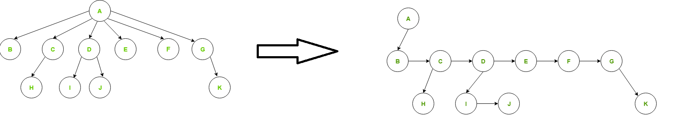

### TREE

#### Basics
##### [Recursion Gyan](https://github.com/pintub/dataStructure-algo/blob/master/DP.md#recursion-gyan)
##### Tail Recursion 
When in recursion method(), last statement of recursion call. So, need to save anything to stack => JVM hotspot optimizer avoid a stack space => You can ignore O(n) space complexity in that case

 
  
Example Tail vs Non-Tail

  <pre>
  nonTailRecursion(i) {
    //some var x computed
    return x + nonTailRecursion(i+1)//x needs to be saved in stack, once nonTailRecursion(i+1) returns it will be added to x
  }
  tailRecursion(i) {
    //some var x computed
    return tailRecursion(i+1)//No need of any save in stack, So JVM optimizes and avoids need of stack for method calls
  }
  </pre>

##### Complete Tree Definition(Yes Used By Heap visual representation)
- If Tree of height h, All leaves are at h or h-1 level
- All leaves are left inclined. That means leaves are filled from left to right as below
<pre>
                    A
                  /  \
                B     C
               / \ 
               D  E
</pre>
##### Complete Tree Vs balanced Tree
Complete Tree is Height-balanced, But reverse not True as below
<pre>
                    A
                  /  \
                B     C
                     / \ 
                     D  E
</pre>
##### Binary Search Tree/BST Definition
- MaxOfLeftSubTree <= NodeValue <= MinOfRightSubTree. `leftNode <= NodeValue <= rightnode Definition is not completely correct, Check below example`
- Inorder of BST is sorted
<pre>
                    5     //Not BST
                  /  \
                1     6
                     / \ 
                     4  7
</pre>
##### Heap Vs BST
BST can be skewed, whereas Complete tree is height-balanced
##### N-ary Tree Representation

 
  
Visual Representation

  

<pre>
Class TreeNode {
  TreeNode firstChild;
  TreeNode nextSibling;
}
</pre>
- Little Tricky, SO see above Diagram : To Find "A" children, FirstChild = B , then from B's nextSibling, C's nextSibling, till nextSibling is null

#### Problems
##### :rocket: Tree Traversal
- DFS
  - PreOrder, PostOrder, InOrder(Recursive & Iterative) :bulb: "Order" term is in terms or placement of root node. `Tricky` PostOrder Iterative
- BFS
  - Level Order(Iterative)
    - For level separator you can use "null" as separator, as we don't save usual nulls in Queue "OR"
    - Another Approach, Rely on last level queue size. 1st level queue has 1 element, Next level has 2, 3rd level has 3(no considering only null nodes). Example, BinaryTreeLevelOrderTraversal102.java 
- Vertical Level Traversal (BinaryTreeVerticalOrderTraversal314Premium.java)
##### :rocket: Diameter Of Tree, Refer DP Docs
##### :rocket: BST Problems
- Insert node to BST
- Delete node to BST (`Tricky`)
  - Delete node w/o child
  - Delete node w/ one child
  - Delete node w/ two child
    - Approach-1 : 1.Reach the node 2.Find Inorder Predecessor or Inorder Successor node 3.If you are going for successor, Copy Inorder Successor node value to delete-node 4. Recursively call delete(Inorder-Successor-value) in right subtree(because we are using inorder successor )
    - [Approach-2](https://www.geeksforgeeks.org/binary-search-tree-set-2-delete/)(Optimized to avoid above last recursion) - Find parent-node of Successor, and make successor null (Successor is always leaf node) 
- Find Max or Min Element
  - Max is Traverse rightNode to rightNode from Root till Null
- Find Inorder Predecessor(Max of left Subtree) or Inorder Successor(Min of right Subtree) of given Node
  - Inorder Predecessor is Traverse rightNode to rightNode from Given-node till Null
- Lowest Common Ancestor(LCA) of 2 given nodes 
- isBST()
  - Approach-1 : InOrder Traversal and keep track of previous `printed` element.
  - Approach-2 : isBST(node) = isBST(rightNode) && isBST(leftNode) && (nodeValue >= leftTreeMax && nodeValue < rightTreeMax)
    - Each node returns 3 things, <MaxOfTreeStartingWithNode, MinOfTreeStartingWithNode, isBSTBoolean>
##### :rocket: Delete Tree all nodes
- :bulb: Use Post-Order and mark root=null as last statement
##### :rocket: Print Binary Tree nodes in reverse-level order
<pre>
                              1         //Print -> 4567231
                            /   \
                           2     3
                          / \   /  \
                         4   5  6  7
</pre>
- :bulb: Use level-order(w/ Queue) & Put in stack
##### :rocket: Find Deepest Node of B.T, i.e. last level's last node
- :bulb: Traverse level-order and last node is Deepest
##### :rocket: Find max-sum-at-any-level of B.T
- :bulb: Traverse level-order and use level-separator
##### :rocket: Print all the paths from Root to Leaf
- :bulb: Think of both Type 1 and Type 2 Recursion
##### :rocket: Build B.T. using InOrder+PreOrder or InOrder+PostOrder Strings
- :bulb: Use Recursion `TODO`
##### :rocket: Zig-zag Traversal
<pre>
                              1         //Print -> 1324567
                            /   \
                           2     3
                          / \   /  \
                         4   5  6  7
</pre>
- :bulb: Level-Order and Two stacks(no queue) `TODO`
##### :rocket: Count# BSTs' with n nodes `Must TODO, DP Problem`
##### :rocket: Convert sorted array to BST
##### :rocket: Find kth the smallest element in BST. Think InOrder recursive solution

#### Binary Tree Serialization Technique Problems
- SerializeAndDeserializeBinaryTree297
- SubtreeOfAnotherTree572

#### Graph Style Question
- AllNodesDistanceKInBinaryTree863

#### Tricky QQuestions
- ConstructBinaryTreeFromPreorderAndInorderTraversal105
- SerializeAndDeserializeBinaryTree297 (Serialization)
- SubtreeOfAnotherTree572 (Serialization)
- PopulatingNextRightPointersInEachNode116 (Create Pointers in level order sibling nodes For Perfect Binary Tree)
- PopulatingNextRightPointersInEachNodeII117 (Create Pointers in level order sibling nodes For Not-Perfect Binary Tree)
- BinaryTreeVerticalOrderTraversal314Premium
- AllNodesDistanceKInBinaryTree863 (DFS Graph-like problem, Distance in parent direction as well)