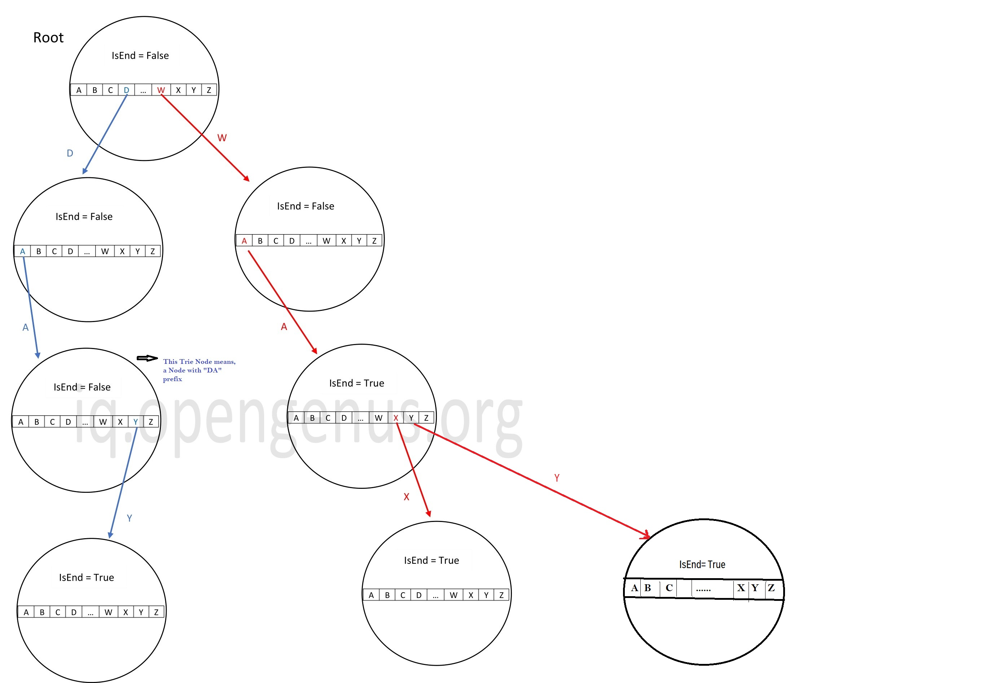
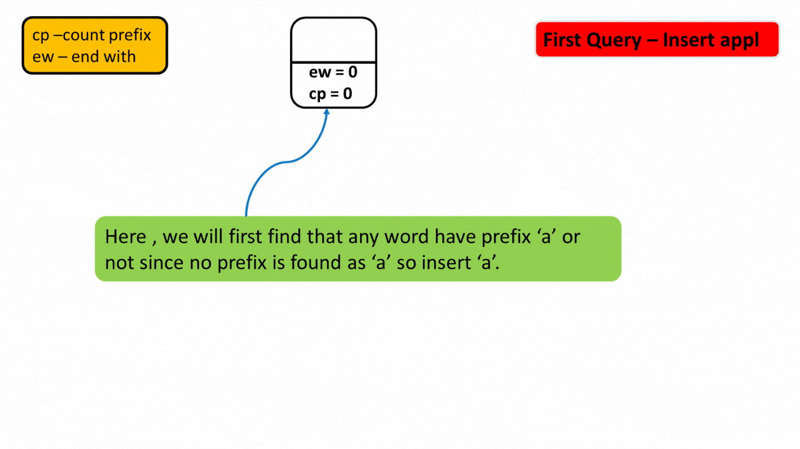

### TRIE

#### [Basics From Striver's Series](https://www.youtube.com/watch?v=Q8LhG9Pi5KM&list=PLgUwDviBIf0pcIDCZnxhv0LkHf5KzG9zp&index=7&ab_channel=takeUforward)

##### Representation
<pre>
Class Node {//Version1 TRIE
    Node[26] charVsReferenceMap;
    boolean isEndOfAWord;
}
</pre>
##### Visual Representation
- Example: {day, wa, wax, way} 
 
- `Leaf-Trie-Node` has all null pointers
- What Any Trie node refers ?? You stand on a visual node, and can say what is the prefix lead to this and what next characters you can go from here. Root means no prefix and next chars are not-null array elements. Though a node doesn't have any info on prefix, visually you can relate this better.  
##### Trie Operations
- [insert(word)](./Practice/src/main/java/com/p2/trie/Trie.java). `Note` insert() sets the state of non-array variables like count or boolean, which is used by search(), count() methods
  - Time = O(#AllCharsOfAllWords), Space= Difficult to determine!!
- search(word)
  - Time = O(#AllCharsOfWord)
- isAnyWordWithPrefix(prefix)
  - Time = O(#AllCharsOfWord)

#### Problems
##### :rocket: count(word), count(prefix), erase(word). `Note` erase(word) means erase only once(even if word is inserted twice) and we will only manipulate the countWord/countPrefix, but actual nodes are not getting deleted.
<pre>
Class Node {//Version2 TRIE
    Node[26] charVsReferenceMap;
    int countWord;   //Count of word which lead to this Node //"ew"
    int countPrefix; //Count of prefix which lead to this Node 
}
</pre>

##### :rocket: isCompleteString(String[] words) : If all prefixes of a word is present in input words[]. Example words[] ={n, ni, nin. ninj. ninja, ninga}, output = ninja
- :bulb: Steps
    - Insert all words to Trie Version-1, Time= O(#AllCharsOfAllWords)
    - For all words, check if all prefixes present, i.e. booleanFlag True at all steps(Except Root) till end of word, Time= O(#AllCharsOfAllWords)
##### :rocket: How many Distinct sub-strings in a Given String using TRIE
- Non-Trie approach: Using two for loop, add all sub-strings in HashSet. Time = O(n^2), space= O(n^2 * AvgStringLength), i.e. n^2 considering each string has approx n sub-strings
- Trie approach: Using two for loop, add all sub-strings in Trie and Keep counting number of Trie nodes. Time = Same O(n^2), space= Optimized as Trie re-uses nodes for same Prefixes, But difficult to count
##### :rocket: Given int[] array & int k, find the max(k xor arrayElement)
- :bulb: How to represent integer in Trie
  - Convert integer -> 32 bit binary -> 32 char String where each char is 0 or 1. `Note` [No need to literally convert to binary-string, instead do binary operations to get/check/set bits](https://takeuforward.org/data-structure/maximum-xor-of-two-numbers-in-an-array/). Example 31st bit is num >>> 31
  - <pre>
    Class Node {//Version3 TRIE
        Node[2] bitVsReferenceMap; //size 2 because only 0/1 possible
        //Other properties as per need
    }
    </pre>
- Solution to above Question using Trie
  - Insert all integers to Trie using Version3 Trie. O(n*32)
  - To maximize (anyNumber xor k)(let's take k=9=000...1001), we would love to have 111....111111 as xor result. So, we would need number to be opposite bits of k. 
    So Traverse through all bits of k & for each bit check if opposite bit exists. If opp. bit exists, set 1 in that position of result, Else set 0. How to set 1-bit for any position? [Refer](./BinaryOperations.md). O(32)
 - Trie solution has no advt yet, Refer next question for benefit
##### :rocket: Given 2 non-negative integer arrays, find the max(anyElementFromArray1 xor anyElementFromArray2)
- :bulb: Extension of above problem. O(n * 32) (Insert Array1 of size n to Trie) + O(m*32)(For each element of Array2 O(32) steps to find max XOR)
- Now you can notice the advt of this over brute-force approach. Brute-force is O(m*n) xors' .
##### :rocket: [Another big-fat Extension of above Question](https://www.codingninjas.com/codestudio/problems/max-xor-queries_1382020)
- :bulb: Sort input[] & Queries

#### Tips
- If Prefix or SubString-Count(SubString is prefix starting at different positions of String) in Question, Think of TRIE
- If max XOR question for non-negative int[] array & given element "k", Think of TRIE Version-3

